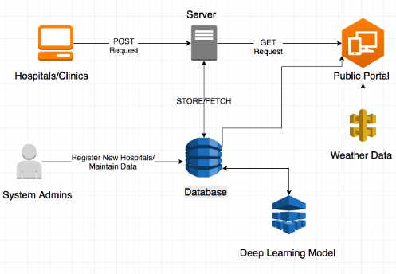

In the SIH edition of 2019, I along with my five other teammates got an opportunity to be one of the top four teams selected from across India for Thermofischer's problem statement in Asia's biggest Hackathon, the Smart India Hackathon.

Under this project, we proposed a real-time epidemic mapping system which can work on the basis of trustworthy crowdsourced data to not only analyze the current epidemic but also prevent the future ones by providing intelligent estimates using state of the art machine learning and artificial intelligence techniques.

<figure>
	
	<figcaption>Flowchart of our proposed model</figcaption>
</figure>

Epidemiology is the study and analysis of the distribution and determinants of health and disease conditions in defined populations. With help of modern communication technologies, this can be done more effectively and faster than ever to yield extraordinary results in

- Analyzing
- Containing
- Predicting
- Generating Real-time warnings and awareness on epidemic outbreaks.

Our proposed model and its source code are available [here](https://github.com/ShreyaGupta08/Epidemic-Spread-SIH)

<!-- <figure>
	
	<figcaption>Our Super Cool Team '2b||!2b' after 3 hours of sleep in 2 days!</figcaption>
</figure> -->

